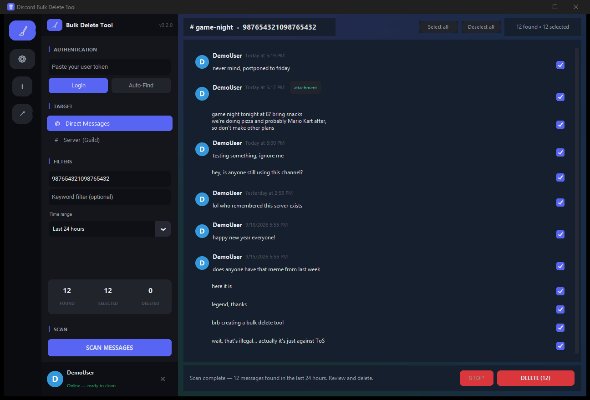

# Discord Bulk Delete Tool

[](https://github.com/prafulaa/DiscordBulkDeleteTool/actions/workflows/ci.yml)
[](https://github.com/prafulaa/DiscordBulkDeleteTool/actions/workflows/release.yml)
[](LICENSE)
[](https://www.python.org/)

Bulk delete **your own** messages from Discord DMs and servers — with a modern
desktop GUI or a CLI. Filter by keyword and date range, preview everything
first, and stay rate-limit safe with built-in pacing.



> [!WARNING]
> **USE AT YOUR OWN RISK.** Automating a user account ("self-botting") is
> technically a violation of [Discord's Terms of Service](https://discord.com/terms).
> The tool adds safety delays and handles rate limits, but you are responsible
> for your own account. This tool only ever deletes **your own** messages —
> it cannot touch anyone else's.

## Features

- **GUI + CLI** — a Discord-styled desktop app (`gui.py`) and an interactive
  terminal flow (`main.py`).
- **Time-range presets** — wipe everything from the last minute, 5/15/30
  minutes, 1/6/12/24 hours, 7 or 30 days, or pick custom after/before dates.
- **Selective deletion** — keyword filter, date ranges, and a dense chat-style
  timeline in the GUI (with Discord-style message grouping and hover details).
- **Dry-run mode** — preview exactly what would be deleted before anything
  happens.
- **Settings that persist** — tune deletion/search delay ranges, the
  consecutive-failure abort limit, and confirmation prompts (saved to
  `settings.json`, editable in-app via the ⚙ rail button or CLI menu option 3).
- **Big-channel support** — Discord caps search results at 5,000; the scan
  automatically re-windows and keeps going past that cap.
- **Rate-limit safe** — honors Discord's `429` responses and `Retry-After`
  headers, with randomized human-like pacing between deletions.
- **Cancel anytime** — a STOP button in the GUI (Ctrl+C in the CLI) halts
  scanning/deleting mid-run without losing partial progress.
- **Failure retry** — messages that failed to delete stay selected so you can
  retry them in one click.
- **Logging** — everything is recorded to `discord_tool.log` (tokens are
  always masked; the log is never uploaded anywhere).

## Setup

Requires **Python 3.9+**.

```bash
git clone https://github.com/prafulaa/DiscordBulkDeleteTool.git
cd DiscordBulkDeleteTool
pip install -r requirements.txt
```

## Getting your token

You need your own **User Token**. Treat it like a password — **never share it,
never post it anywhere.**

1. Open Discord (desktop app or browser).
2. Press `Ctrl + Shift + I` to open Developer Tools.
3. Open the **Network** tab and type `api` in the filter box.
4. Refresh Discord (`Ctrl + R`).
5. Click any request (e.g. `library`, `messages`).
6. Under **Request Headers**, copy the `authorization` value.

You can provide the token three ways (checked in this order):

| Method | How |
|---|---|
| Environment variable | `set DISCORD_TOKEN=your-token` (Windows) / `export DISCORD_TOKEN=your-token` (macOS/Linux) |
| Local file | Put it in a `token.txt` next to the scripts — **this file is gitignored, never commit it** |
| Manual | Paste it into the GUI field, or at the hidden CLI prompt |

The GUI's **Auto-Find** button can also read a plaintext token from the
locally installed Discord desktop app (Windows/macOS/Linux). It deliberately
does *not* touch browsers or decrypt anything — newer Discord versions store
the token encrypted, in which case just paste it manually.

## Theming & credits

The UI takes its visual cues from Discord's dark theme and the excellent
[ClearVision](https://github.com/ClearVision/ClearVision-v6) theme (Apache-2.0)
— icon rail, channel sidebar, chat-style message list and all.

- **No third-party images are bundled.** The aurora wallpaper and the avatars
  are generated procedurally at runtime with Pillow (`theme.py`).
- **Custom wallpaper**: drop your own image at `assets/background.png` and it
  is cover-fitted and darkened automatically. If the image isn't yours, make
  sure its license allows it and credit its author.

## Usage

### GUI

```bash
python gui.py
```

1. Paste your token → **Login**.
2. Choose **Direct Message** or **Server (Guild)**.
3. Paste the ID (enable **Developer Mode** in Discord settings, then
   right-click a DM → *Copy Channel ID*, or a server icon → *Copy Server ID*).
4. Optionally set a keyword filter and/or an *after/before* date range.
5. **Scan** → review the timeline → tick the messages to delete.
6. **DELETE (n)** → confirm. Messages that fail stay selected for a retry.

### CLI

```bash
python main.py
```

Walks you through: context (DM/server), ID, keyword, optional date range,
scan preview, dry-run, and a final confirmation before deleting.

## Building executables

Prefer not to install Python? Build standalone Windows executables with
[PyInstaller](https://pyinstaller.org/):

```bash
pip install -r requirements.txt pyinstaller
pyinstaller DiscordToolGUI.spec --noconfirm   # → dist/DiscordBulkDeleteTool.exe
pyinstaller DiscordTool.spec   --noconfirm   # → dist/DiscordBulkDeleteTool-CLI.exe
```

Tagged releases (`v*`) are built and attached automatically by GitHub Actions.

## Troubleshooting

| Symptom | Cause & fix |
|---|---|
| **401 Unauthorized** | Token expired or invalid — grab a fresh one. |
| **403 Forbidden on delete** | You can't delete that message (e.g. a system message). The tool skips it and keeps going. |
| **429 Too Many Requests** | Normal — the tool sleeps and retries automatically. If it happens constantly, pause for a few hours. |
| **Search returns only 5,000 results** | Discord's hard search cap; the tool works around it with windowed scanning. |
| **GUI won't open** | Ensure `customtkinter` is installed (`pip install -r requirements.txt`). |
| **Antivirus flags the .exe** | PyInstaller binaries sometimes trigger heuristics. Build it yourself from source, or run from Python. |

## Safety notes

- Deletions are paced with randomized delays and all rate limits are honored.
- Scanning/deleting stops automatically after repeated consecutive failures.
- The tool only deletes messages authored by the logged-in account — there is
  no mode to delete anyone else's messages.
- `token.txt` and `*.log` are gitignored; tokens are masked in all logs.

## Project layout

```
api_client.py     Discord REST client (timeouts, retries, rate limits)
deleter.py        Scan + bulk-delete engine (pagination, dry-run, cancellation)
gui.py            CustomTkinter desktop app (Discord/ClearVision-style UI)
theme.py          Procedural wallpaper + avatars (Pillow, no bundled images)
settings.py       Persistent user settings (settings.json)
main.py           Interactive CLI
auth.py           Token loading (env var / token.txt / prompt)
token_finder.py   Optional: find plaintext token from the local Discord app
utils.py          Logging, snowflake/date helpers
scripts/          Dev utilities (GUI screenshot generator)
tests/            pytest suite (92 tests)
```

## Development

```bash
pip install -r requirements.txt -r <(echo -e "pytest\nruff")   # or: pip install .[dev]
ruff check .
pytest -v
```

CI runs ruff + pytest on Linux and Windows (Python 3.10 & 3.12) on every push.

## Contributing

Issues and PRs are welcome — see [CONTRIBUTING.md](CONTRIBUTING.md).

## License

[MIT](LICENSE) © 2026 prafulaa. Free for anyone to use, modify, and
redistribute — see the license for details.
